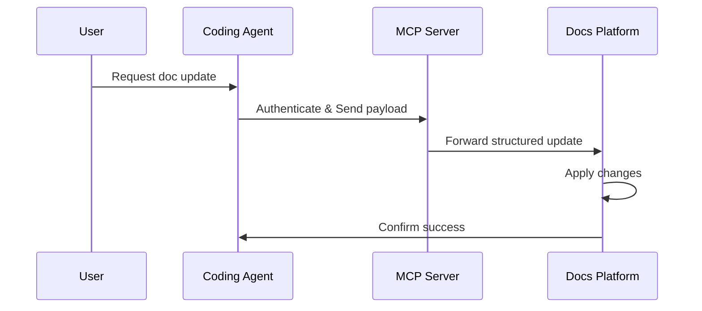

## Overview

Yashwanth Muddana provides `Beautiful, Lightning Fast Docs that Drive Adoption`. You build documentation that stays current with your product using AI-powered tools. Core concepts include the AI Documentation Agent, structured content optimized for AI, docs-as-code workflows, and MCP integration for coding agents.

These features ensure your docs evolve automatically, serve humans with clear readability, and enable LLMs to extract precise information.

<Columns cols={2}>
  <Card title="AI Documentation Agent" icon="zap" href="#ai-agent">
    Automates updates to keep your docs fresh without manual effort.
  </Card>
  <Card title="Structured Content" icon="database" href="#structured-content">
    Formats content so AI agents and search engines understand it instantly.
  </Card>
  <Card title="Docs-as-Code" icon="code" href="#docs-as-code">
    Manage docs like code with version control and CI/CD.
  </Card>
  <Card title="MCP Integration" icon="settings" href="#mcp-integration">
    Connect coding agents via MCP for seamless automation.
  </Card>
</Columns>

## AI Documentation Agent

The AI Documentation Agent scans your product changes and suggests updates. It rewrites sections, fixes structure, and summarizes improvements directly in the web editor.

<Callout kind="info">
  Enable the agent in your dashboard at `https://dashboard.example.com/settings/ai-agent`.
</Callout>

<Steps>
  <Step title="Connect Repository" icon="git-branch">
    Link your GitHub repo to monitor code changes.
  </Step>
  <Step title="Review Suggestions" icon="eye">
    The agent proposes edits based on recent commits.
  </Step>
  <Step title="Approve and Publish" icon="check-circle">
    Apply changes with one click and deploy instantly.
  </Step>
</Steps>

## Structured Content for AI

Structure your content with semantic headings, lists, and code blocks. This makes it `AI-ready out of the box` for LLMs and agents.

<CodeGroup tabs="Structured,Unstructured">
  ```markdown
  ## Endpoint

  **Method:** `POST`
  **Path:** `/api/users`

  ### Parameters
  - `name` (string, required): User name
  ```
  ```markdown
  Create users at /api/users via POST with name parameter.
  ```
</CodeGroup>

Use `<ParamField>` components for API docs to enhance structure.

## Docs-as-Code Workflow

Treat docs as code. Edit in your IDE, commit changes, and deploy via CI/CD.

<Tabs>
  <Tab title="GitHub Actions" icon="github">
    ```yaml
    name: Deploy Docs
    on: [push]
    jobs:
      deploy:
        runs-on: ubuntu-latest
        steps:
          - uses: actions/checkout@v4
          - name: Build and Deploy
            run: |
              npm ci
              npm run build
              npx docs deploy
    ```
  </Tab>
  <Tab title="Netlify" icon="cloud">
    ```toml
    [build]
      command = "npm run build"
      publish = "dist"
    ```
  </Tab>
</Tabs>

## MCP Integration for Coding Agents

Integrate with MCP (Multi-Context Protocol) to let coding agents update docs programmatically.



<Expandable title="Advanced MCP Setup" default-open="false">

Configure MCP endpoints:

```javascript
const mcpConfig = {
  endpoint: 'https://mcp.example.com/v1',
  token: 'YOUR_MCP_TOKEN'
};
```

</Expandable>

<Board title="Docs Maintenance Workflow">
  <BoardColumn title="Backlog" color="0" icon="circle">
    <BoardCard title="Update API reference" description="Sync with latest endpoints" dueDate="2024-12-15" />
  </BoardColumn>
  <BoardColumn title="AI Review" color="1" icon="zap">
    <BoardCard title="Rewrite onboarding guide" author="AI Agent" />
  </BoardColumn>
  <BoardColumn title="Published" color="2" icon="check-circle">
    <BoardCard title="Changelog v2.1.0" createdAt="2024-12-01" />
  </BoardColumn>
</Board>

<Callout kind="tip">
  Start with the AI agent for quick wins, then layer in docs-as-code for teams.
</Callout>