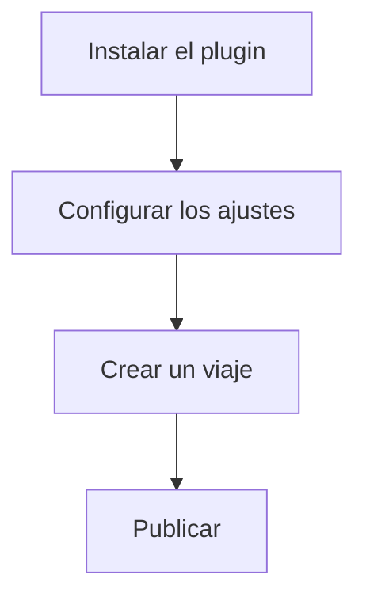

## Requisitos previos

Antes de instalar WP Travel Engine, comprueba que tu sitio de WordPress cumple estos requisitos:

<Callout kind="info" title="Requisitos del sistema">
- WordPress 5.0 o superior
- PHP 7.4 o superior
- MySQL 5.6+ o MariaDB 10.1+
- Memoria mínima de 256 MB (se recomiendan 512 MB o más)
</Callout>

Verifica que tu alojamiento admite estas especificaciones. Comprueba tu sitio con la [herramienta Health Check de WordPress](https://wordpress.org/plugins/health-check/).

## Métodos de instalación

Elige el método que mejor encaje con tu forma de trabajar. Usa el panel de WordPress si buscas sencillez, o la subida manual para configuraciones personalizadas.

<Tabs>
  <Tab title="Panel de WordPress" icon="settings">

<Steps>
  <Step title="Descarga el plugin">
    Descarga el ZIP más reciente de WP Travel Engine desde tu panel de compras o desde el repositorio oficial de WordPress.
  </Step>

  <Step title="Sube e instala">
    Ve a **Plugins > Add New > Upload Plugin** en la administración de WordPress.
    
    Selecciona el archivo ZIP y haz clic en **Install Now**.
  </Step>

  <Step title="Activa">
    Después de la instalación, haz clic en **Activate Plugin** para habilitar WP Travel Engine.
  </Step>
</Steps>

  </Tab>

  <Tab title="Subida manual por FTP" icon="upload">

<Steps>
  <Step title="Extrae los archivos">
    Descomprime el paquete de WP Travel Engine en tu ordenador.
  </Step>

  <Step title="Sube por FTP">
    Usa un cliente FTP como FileZilla para subir la carpeta del plugin a `/wp-content/plugins/wptravelengine/`.
  </Step>

  <Step title="Activa desde el panel">
    Ve a **Plugins** en la administración de WordPress y activa WP Travel Engine.
  </Step>
</Steps>

````bash
# Example FTP command (using lftp for automation)
lftp -u username,password ftp.example.com -e "mirror /local/path/to/wptravelengine /wp-content/plugins/; quit"
````

  </Tab>
</Tabs>

## Configuración básica

Después de la activación, configura los ajustes esenciales:

<Steps>
  <Step title="Abre los ajustes" icon="settings">
    Ve a **WP Travel Engine > Settings** en el menú de administración.
  </Step>

  <Step title="Define la moneda y las unidades" icon="dollar-sign">
    Elige la moneda predeterminada (por ejemplo, USD), el formato de fecha y las unidades de medida.
  </Step>

  <Step title="Activa funciones" icon="check-circle">
    Activa los formularios de consulta de viajes, las opciones de reserva y las pasarelas de pago.
  </Step>

  <Step title="Guarda los cambios">
    Haz clic en **Save Settings** para aplicarlos.
  </Step>
</Steps>

<CodeGroup tabs="Shortcode PHP,Editor de bloques">
```php
// Add this shortcode to any page to display trips
[wptravel_trip_search]
[wptravel_trips]
```

```jsx
// In Gutenberg Block Editor, search for "WP Travel Engine" blocks
// Add: Trip Search, Trips List, Single Trip
```
</CodeGroup>

## Solución de problemas habituales

<ExpandableGroup>
  <Expandable title="¿El plugin no aparece en el menú?" default-open="true">
    Vacía la caché de los plugins de caché (por ejemplo, WP Rocket o W3 Total Cache). Desactiva los plugins que puedan entrar en conflicto, como otras herramientas de viajes o reservas. Asegúrate de que tu rol de usuario tiene privilegios de administrador.
  </Expandable>

  <Expandable title="¿Pantalla en blanco o errores?">
    Aumenta el límite de memoria de PHP en `wp-config.php`:
    
````php
define('WP_MEMORY_LIMIT', '512M');
````

    Revisa los registros de errores desde el panel de tu alojamiento o activa el modo de depuración de WordPress.
  </Expandable>

  <Expandable title="¿Las reservas no funcionan?">
    Comprueba los enlaces permanentes: **Settings > Permalinks > Save Changes**. Instala los complementos necesarios, como las pasarelas de pago, si hace falta.
  </Expandable>
</ExpandableGroup>

<Callout kind="tip" title="¿Necesitas ayuda?">
Consulta los [foros de soporte de WP Travel Engine](https://wptravelengine.com/support/) o contacta con tu proveedor de alojamiento si el problema es del servidor.
</Callout>

## Próximos pasos

<Columns cols={3}>
  <Card title="Crea tu primer viaje" icon="map" href="/create-trip">
    Aprende a añadir itinerarios, precios y galerías.
  </Card>

  <Card title="Configura los pagos" icon="credit-card" href="/payments">
    Configura pasarelas como PayPal o Stripe.
  </Card>

  <Card title="Personaliza las plantillas" icon="brush" href="/customization">
    Da estilo a tu sitio de viajes con bloques y temas.
  </Card>
</Columns>



Tu sitio con WP Travel Engine ya está listo. ¡Empieza a crear viajes y a recibir reservas!
