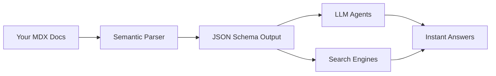

## Overview

Yashwanth Muddana provides a comprehensive documentation platform optimized for AI agents and humans. You get tools for AI-assisted updates, interactive user assistance, flexible publishing workflows, and structured content ready for LLMs. These features help you maintain fresh docs that accelerate onboarding and reduce support needs.

<Columns cols={2}>
  <Card title="AI Assistant for Users" icon="bot" href="#ai-assistant">
    Embed a chat interface in your docs so users get instant, cited answers to questions.
  </Card>
  <Card title="Flexible Publishing" icon="edit-3" href="#publishing">
    Publish via web editor or code-based workflows to fit your team's process.
  </Card>
  <Card title="Automatic Updates" icon="refresh-cw" href="#updates">
    An AI agent suggests and applies changes to keep docs in sync with your product.
  </Card>
  <Card title="AI-Ready Optimization" icon="cpu" href="#optimization">
    Structured formats ensure LLMs, agents, and search engines understand your content instantly.
  </Card>
</Columns>

## AI Assistant for Users

Enable an AI assistant directly in your documentation. Users ask natural language questions and receive accurate, context-aware responses with citations from your docs. This reduces support tickets by 50% or more.

<Callout kind="tip">
  Start with the basic setup to see immediate value, then customize prompts for your domain.
</Callout>

<Steps>
  <Step title="Enable Assistant" icon="toggle-right">
    In your dashboard at `https://dashboard.example.com`, navigate to Settings > AI Assistant and toggle it on.
  </Step>
  <Step title="Embed in Docs">
    Add the embed script to your MDX pages:
    
````html
<script src="https://docs.example.com/assistant.js" data-site="your-site-id"></script>
````
    
  </Step>
  <Step title="Customize">
    Define system prompts like "Answer based only on Yashwanth Muddana docs."
  </Step>
</Steps>

## Flexible Publishing Options

Choose how you publish: a no-code web editor for quick changes or docs-as-code for version control.

<Tabs>
  <Tab title="Web Editor" icon="edit">
    Edit MDX visually with live preview.
    
    <Image
      src="https://framerusercontent.com/images/nNbh7KYw5UhsBIeybqe5vyIXY.png"
      alt="Web editor interface"
      width="800"
      height="600"
    />
  </Tab>
  <Tab title="Docs-as-Code" icon="code">
    Use Git workflows with MDX files.
    
    <CodeGroup tabs="MDX,CLI">
```mdx
---
title: My Page
---

## Content

Use components like `<Callout>`.
```
```bash
# Push changes
git add .
git commit -m "Update features"
git push origin main

# Auto-deploy triggers
```
    </CodeGroup>
  </Tab>
</Tabs>

## Automatic Doc Updates

Your AI Documentation Agent monitors your product changes and proposes updates. It rewrites sections, fixes structure, and summarizes diffs automatically.

<Expandable title="How the Agent Works" default-open="true">
  1. Connect your repo or API at `https://api.example.com/docs/agent`.
  2. Agent scans commits and suggests edits.
  3. Review and approve in the dashboard.
  
  Example webhook payload:
  
````json
{
  "event": "pull_request",
  "suggestions": [
    {
      "path": "/features.mdx",
      "diff": "Add new AI feature description"
    }
  ]
}
````
</Expandable>

<Callout kind="info">
  Agent respects your style guide and only suggests non-breaking changes.
</Callout>

## AI-Ready Optimization

Content is automatically structured with semantic markup, schemas, and clean hierarchies. This makes your docs parseable by LLMs without extra work.



<Board title="Feature Roadmap">
  <BoardColumn title="Shipped" color="2" icon="check-circle">
    <BoardCard title="AI Assistant Embed" description="Chat in any doc page" createdAt="2024-10-01" />
    <BoardCard title="Web Editor v2" icon="edit" />
  </BoardColumn>
  <BoardColumn title="In Progress" color="1" icon="loader">
    <BoardCard title="Multi-Language Docs" description="Auto-translate with AI" dueDate="2024-12-15" />
  </BoardColumn>
  <BoardColumn title="Planned" color="0" icon="circle-dot">
    <BoardCard title="Voice Search" icon="mic" />
  </BoardColumn>
</Board>

<Columns cols={2}>
  <Card title="Quickstart" icon="book-open" href="/quickstart">
    Set up your first doc site.
  </Card>
  <Card title="Authentication" icon="shield" href="/authentication">
    Secure your docs and API.
  </Card>
</Columns>